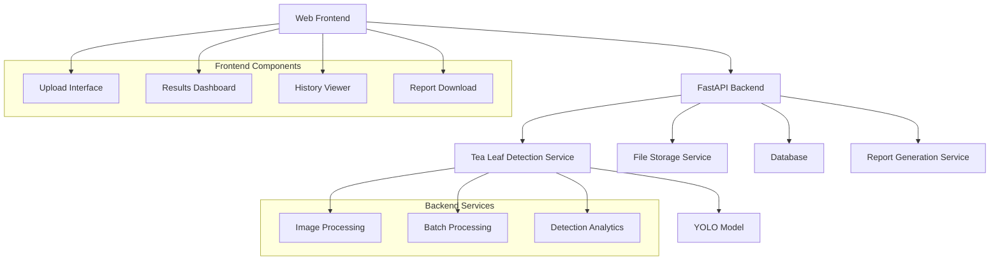

# Tea Leaf Detection Website - Implementation Plan

## 🔍 **Project Overview**
Create a comprehensive web application that enables users to upload tea leaf images for AI-powered health detection and analysis using the existing YOLOv8 model.

## 📋 **Current System Analysis**
- **Existing Assets**: YOLOv8 trained model (`best.pt`) with 2 classes (healthy/unhealthy)
- **Detection Logic**: `test.py` provides core inference functionality
- **Camera Integration**: `cam.py` offers real-time detection capabilities  
- **Data Structure**: `data.yaml` defines class mapping (0=unhealthy, 1=healthy)
- **Model Performance**: Trained weights available at `runs/detect/train/weights/best.pt`

## 🏗️ **System Architecture**



## 🚀 **Technology Stack**
- **Backend**: FastAPI, SQLAlchemy, Pydantic
- **ML Integration**: Ultralytics YOLO (existing model)
- **Database**: SQLite (development) → PostgreSQL (production)
- **Frontend**: HTML5, JavaScript, Bootstrap/Tailwind CSS
- **Image Processing**: OpenCV, Pillow
- **Reports**: ReportLab (PDF), Pandas (CSV), Plotly (charts)
- **Deployment**: Uvicorn, Docker (optional)

## 📁 **Project Structure**
```
tea-leaf-website/
├── app/
│   ├── main.py                 # FastAPI app entry point
│   ├── models/                 # Database models
│   │   ├── __init__.py
│   │   ├── detection.py        # Detection result models
│   │   └── session.py          # Session models
│   ├── services/               # Business logic
│   │   ├── __init__.py
│   │   ├── detection_service.py # Core detection logic
│   │   ├── batch_service.py     # Batch processing
│   │   └── report_service.py    # Report generation
│   ├── api/                    # API endpoints
│   │   ├── __init__.py
│   │   ├── upload.py           # Upload endpoints
│   │   ├── detection.py        # Detection endpoints
│   │   └── reports.py          # Report endpoints
│   ├── utils/                  # Helper functions
│   │   ├── __init__.py
│   │   ├── image_utils.py      # Image processing utilities
│   │   └── validation.py       # Input validation
│   └── database.py             # Database configuration
├── static/                     # Frontend assets
│   ├── css/
│   ├── js/
│   └── images/
├── templates/                  # HTML templates
│   ├── index.html
│   ├── results.html
│   └── history.html
├── uploads/                    # Uploaded images storage
├── results/                    # Detection results storage
├── reports/                    # Generated reports storage
├── requirements.txt
├── README.md
└── .env                        # Environment variables
```

## 📋 **Implementation Phases**

### **Phase 1: Core Backend Development**
1. **FastAPI Application Setup**
   - Create main FastAPI app with CORS configuration
   - Set up file upload endpoints with validation
   - Integrate existing `test.py` logic into service class
   - Configure SQLAlchemy for database operations

2. **Detection Service Integration**
   - Refactor `test.py` into a reusable `TeaLeafDetectionService` class
   - Enhance with batch processing capabilities
   - Add image preprocessing and validation
   - Implement confidence threshold configuration

3. **Database Setup**
   - SQLite for development (easy setup)
   - Schema for detection sessions, results, and image metadata
   - Models for tracking detection history
   - Migration system for schema updates

### **Phase 2: Advanced Features**
1. **Batch Processing System**
   - Multi-image upload endpoint
   - Async processing with progress tracking
   - Zip file support for bulk uploads
   - Queue management for large batches

2. **Detection History**
   - Session-based tracking
   - Results persistence with timestamps
   - Image gallery with thumbnails
   - Search and filter capabilities

3. **Report Generation**
   - PDF reports with detection summaries
   - CSV export for data analysis
   - Charts and visualizations using matplotlib/plotly
   - Customizable report templates

### **Phase 3: Frontend Development**
1. **Modern Web Interface**
   - HTML5 drag-and-drop upload
   - Real-time progress indicators
   - Responsive design with Bootstrap/Tailwind
   - Mobile-friendly interface

2. **Results Visualization**
   - Interactive image viewer with bounding boxes
   - Health statistics dashboard
   - Historical data charts
   - Comparison tools for multiple sessions

### **Phase 4: Enhancement & Optimization**
1. **Performance Optimization**
   - Image compression and resizing
   - Caching mechanisms
   - Async processing queues
   - Database query optimization

2. **Additional Features**
   - API documentation with FastAPI's automatic docs
   - Rate limiting and security headers
   - Logging and monitoring
   - Error handling and user feedback

## 📊 **API Endpoints Design**

### Core Endpoints
```
POST /api/upload/single          # Single image upload
POST /api/upload/batch           # Multiple images upload  
GET  /api/results/{session_id}   # Get detection results
GET  /api/history               # Detection history
GET  /api/download/report/{id}   # Download PDF/CSV report
GET  /api/stats                 # Overall statistics
```

### Additional Endpoints
```
GET  /api/sessions              # List all sessions
DELETE /api/sessions/{id}       # Delete session
GET  /api/health               # Health check
GET  /docs                     # Auto-generated API docs
```

## 🔧 **Key Features Implementation**

### 1. **Image Upload & Validation**
- Support JPEG, PNG, WEBP formats
- File size limits (max 10MB per image)
- Image quality and format validation
- Malware scanning for uploaded files

### 2. **Detection Integration**
- Use existing `best.pt` model from `runs/detect/train/weights/`
- Leverage `test.py` counting logic for health analysis
- Configurable confidence thresholds (default 0.25)
- Support for custom model paths

### 3. **Results Processing**
- Annotated images with bounding boxes
- Health statistics (healthy vs unhealthy counts)
- Percentage calculations and trends
- Detailed detection metadata

### 4. **Batch Processing**
- Queue-based processing for multiple images
- Progress tracking with WebSocket updates
- Error handling for failed detections
- Parallel processing for improved performance

### 5. **Report Generation**
- PDF reports with:
  - Detection summary
  - Annotated images
  - Health statistics
  - Trends and analysis
- CSV exports with raw data
- Customizable report templates

## 🗄️ **Database Schema**

### Detection Sessions
```sql
CREATE TABLE detection_sessions (
    id INTEGER PRIMARY KEY,
    name VARCHAR(255),
    created_at TIMESTAMP,
    status VARCHAR(50),
    total_images INTEGER,
    processed_images INTEGER
);
```

### Detection Results
```sql
CREATE TABLE detection_results (
    id INTEGER PRIMARY KEY,
    session_id INTEGER,
    image_path VARCHAR(500),
    healthy_count INTEGER,
    unhealthy_count INTEGER,
    total_count INTEGER,
    health_percentage FLOAT,
    confidence_threshold FLOAT,
    processing_time FLOAT,
    created_at TIMESTAMP,
    FOREIGN KEY (session_id) REFERENCES detection_sessions(id)
);
```

### Detection Boxes
```sql
CREATE TABLE detection_boxes (
    id INTEGER PRIMARY KEY,
    result_id INTEGER,
    class_id INTEGER,
    confidence FLOAT,
    x1 FLOAT,
    y1 FLOAT,
    x2 FLOAT,
    y2 FLOAT,
    FOREIGN KEY (result_id) REFERENCES detection_results(id)
);
```

## 🚀 **Deployment Considerations**

### Development Environment
- Use SQLite for database
- Local file storage for images
- Debug mode enabled
- Hot reload for development

### Production Environment
- PostgreSQL database
- Cloud storage for images (AWS S3, etc.)
- Redis for caching and queues
- Docker containerization
- NGINX reverse proxy
- SSL/TLS encryption

## 📈 **Success Metrics**
- ✅ Successful integration with existing YOLO model
- ✅ Working single and batch image processing
- ✅ Persistent detection history storage
- ✅ Downloadable PDF and CSV reports
- ✅ Responsive and user-friendly interface
- ✅ Real-time progress tracking
- ✅ Error handling and validation
- ✅ API documentation

## 🔒 **Security Considerations**
- File upload validation and sanitization
- Rate limiting for API endpoints
- CORS configuration
- Input validation and sanitization
- Secure file storage
- Error message sanitization

## 📝 **Dependencies (requirements.txt)**
```
fastapi==0.104.1
uvicorn==0.24.0
sqlalchemy==2.0.23
pydantic==2.5.0
pillow==10.1.0
opencv-python==4.8.1.78
ultralytics==8.0.200
pandas==2.1.3
plotly==5.17.0
reportlab==4.0.7
python-multipart==0.0.6
jinja2==3.1.2
aiofiles==23.2.1
```

## 🎯 **Next Steps**
1. Set up the project structure
2. Implement core FastAPI application
3. Integrate existing YOLO model
4. Create database models and migrations
5. Develop upload and detection endpoints
6. Build frontend interface
7. Add batch processing capabilities
8. Implement report generation
9. Add testing and documentation
10. Deploy and optimize

This comprehensive plan provides a roadmap for creating a professional tea leaf detection website that leverages your existing AI model while adding powerful web-based features for enhanced usability and analysis.
